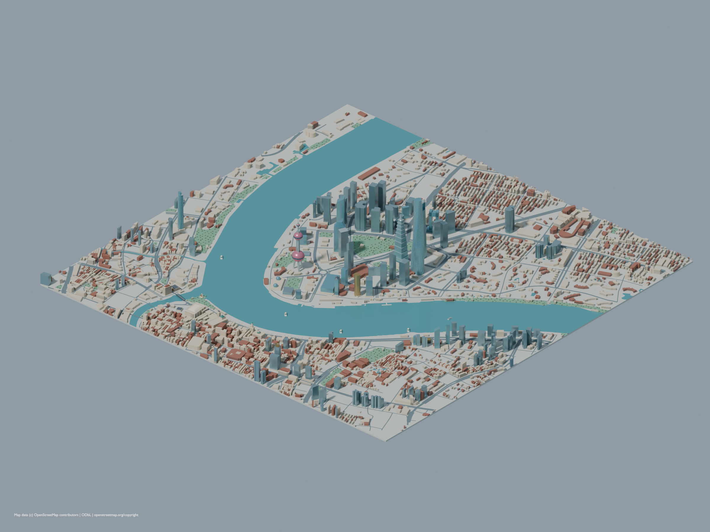
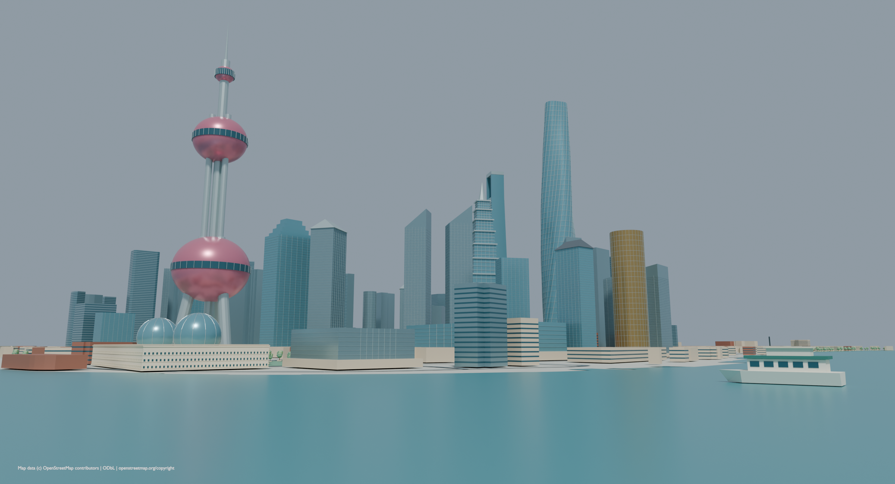
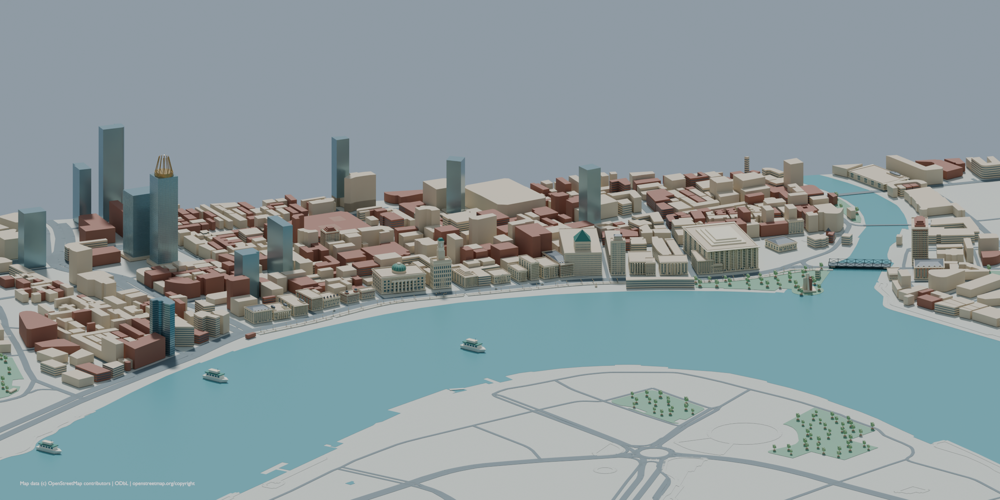
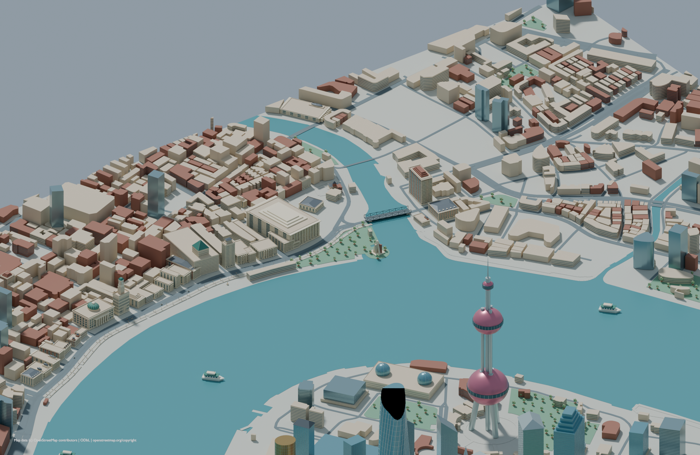
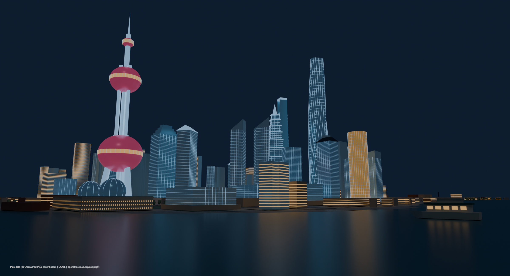

# 外滩两岸与周边街区 · 3D 素材物料

使用本机 **Blender 5.2.1 LTS** 制作。第二版扩展到约 **3.5 × 3.47 公里**的米制场景：**67 处命名地标、2,767 个周边建筑轮廓、87 个独立素材**。补齐黄浦江弯道、苏州河口、沿江道路、公园及后排街区，提供日景、夜景和多个观察角度。

## 直接打开

| 文件 | 用途 |
| --- | --- |
| [完整场景](source/bund-environment.blend) | 外滩、陆家嘴、苏州河口与周边街区，按区域分 Collection |
| [夜景源文件](source/bund-night.blend) | 可编辑夜景材质和照明 |
| [素材库](source/bund-asset-library.blend) | 87 个建筑和配件，已标记为 Blender Assets |
| [完整场景 GLB](models/bund-environment.glb) | 标准 glTF 2.0，包含材质，无外部贴图 |
| [覆盖范围图](previews/coverage-map.svg) | 橙色为单独建模地标，灰色为周边建筑轮廓 |
| [完整清单](manifest.json) | 地标模型、地图要素、坐标、尺寸、高度依据与面数 |
| [验证结果](validation.json) | GLB 重新导入、源文件重新打开、几何及预览检查 |











## 新增建筑范围

- **外滩历史建筑带**：亚细亚、上海总会、有利、日清、通商银行、大北电报、轮船招商局、原汇丰、江海关、交通银行、华俄道胜银行、台湾银行、字林大楼、麦加利银行、汇中饭店、和平饭店、中国银行、横滨正金银行、扬子保险、怡和洋行、格林邮船、东方汇理银行等。
- **苏州河口、外滩源与北外滩**：原英国领事馆、半岛酒店、上海大厦、浦江饭店、俄罗斯领事馆、新天安堂、亚洲文会大楼、邮政总局、光陆大楼、兰心大楼、益丰洋行、白玉兰办公塔楼等。
- **陆家嘴**：东方明珠、上海中心、金茂、环球金融中心、国金中心双塔、震旦、国际会议中心、正大广场、水族馆、香格里拉双楼、中银大厦、太平金融、中国保险、招商局、交银、农银、建行、证券交易所、花旗、时代金融中心、浦东美术馆等。
- **周边与环境**：外滩中心、威斯汀、外滩金融中心四栋塔楼、复星艺术中心，以及外白渡桥、人民英雄纪念塔、陈毅雕像轮廓、渡口、步道、栏杆、路灯、长椅、绿地、游船、车辆和导览设施。

背景楼群依照 OSM 外轮廓建模，并保留名称与来源。它们提供街区密度和天际线层次，立面细节低于上述单独建模地标。

## 分区 GLB

除 87 个独立素材外，提供 6 个组合文件；分区保留同一世界坐标，加载到同一原点即可拼合：

- [bund-environment.glb](models/bund-environment.glb)：完整场景，包含全部内容。
- [bund-historic-district.glb](models/bund-historic-district.glb)：外滩主要历史建筑及南侧地标。
- [lujiazui-skyline.glb](models/lujiazui-skyline.glb)：陆家嘴命名地标。
- [suzhou-north-bund.glb](models/suzhou-north-bund.glb)：苏州河口、外滩源和北外滩地标。
- [surrounding-buildings.glb](models/surrounding-buildings.glb)：周边建筑轮廓。
- [river-roads-parks.glb](models/river-roads-parks.glb)：水面、地表、道路与绿地。

这五个分区文件不含已布置的散件。需要完整布景时直接用完整场景；也可从素材库自行放置设施。不要把完整场景和分区一起叠加加载。

## 还原依据

**位置与尺度**：采用保存的 OpenStreetMap 数据，原点为东经 121.490°、北纬 31.239°，Blender 中 X 向东、Y 向北、Z 向上，1 单位为 1 米。GLB 自动转换为 Y 向上。楼位、朝向、背景建筑外轮廓、道路中心线与岸线有地图依据；命名地标外形适配该楼位和朝向。

**高度**：有公开建筑高度或 OSM 高度标签时优先采用；其次按 OSM 楼层数 × 估算层高；缺少数据时采用标注为估算的体量。依据保存在每个对象的 height_source 与清单中。上海中心 632 米、环球金融中心 492 米、东方明珠 468 米、金茂 420.5 米使用同一米制比例。

**外观**：地标分别建有柱廊、拱券、窗框、檐口、塔顶、幕墙及屋顶特征，属于建筑特征复原；没有达到照片测量或逐窗复刻精度。背景楼只表达外轮廓和楼层带，复杂内院与内部空间未复刻。部分设施位置、船位、道路宽度和夜间照明是场景设计值。

**材质**：Blender 文件保留程序化石材与 Cycles 灯光；GLB 使用标准 PBR 基础色、金属度、粗糙度和自发光。程序化石材凹凸未烘焙到 GLB。完整模型优先细节，手机端应按需选取分区或独立素材，再做实际设备性能验证。素材目录不会自动进入现有游戏构建。

## 重建与验证

在仓库根目录运行 PowerShell：

```powershell
# 重建模型、源文件和全部预览
& 'D:\setup\Blender\blender.exe' --background --factory-startup --python-exit-code 1 --python assets/bund/build.py

# 单独检查地理计算
python assets/bund/geography.py

# 重新导入全部 GLB，并检查源文件与预览
& 'D:\setup\Blender\blender.exe' --background --factory-startup --python-exit-code 1 --python assets/bund/verify.py
```

建模命令末尾加 `-- --no-render` 可跳过渲染。随后可独立重新渲染已保存的源文件：

```powershell
& 'D:\setup\Blender\blender.exe' --background --factory-startup --python-exit-code 1 --python assets/bund/render.py
```

渲染命令末尾可加 `-- pudong-from-bund.png`，只生成指定预览。重建会覆盖本目录的生成文件，手工编辑源文件前请另存副本。

geometry.py 保存基础模型与网格工具，architecture.py 保存新增建筑外观，landmarks.json 关联楼名与地图要素，city.py 组装场景。地图摘录在 reference/，离线重建不需要联网；确需更新时运行 fetch-map.py 和 fetch-map.py --pois。

## 地图署名

地图数据 © [OpenStreetMap contributors](https://www.openstreetmap.org/copyright)，数据依照 ODbL 提供。截图已保留署名；接入产品或分发素材时保留 [数据来源与授权说明](reference/ATTRIBUTION.md)，并在展示地图场景的页面显示相应署名和链接。

